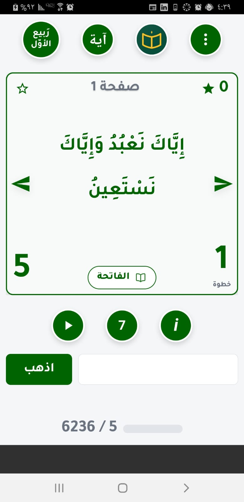
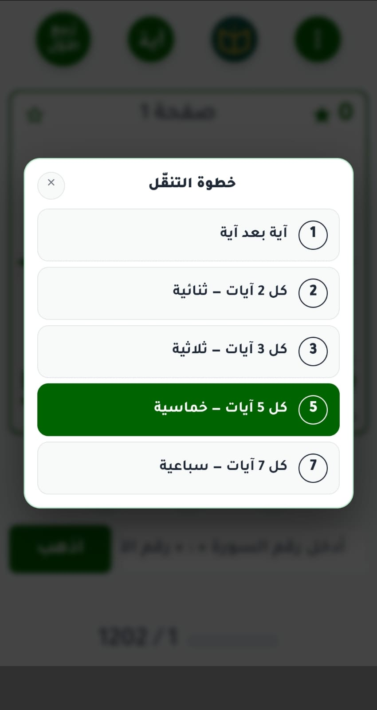
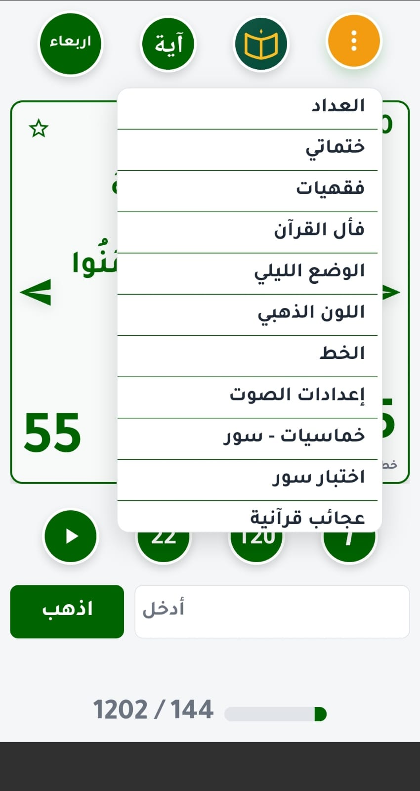

# Quran Fives (الخماسيات)

A paid Quran **indexing-memorization** app, **live on Google Play**. Built with React +
Capacitor — one codebase running on Android, iOS and web (PWA). Arabic-first, fully offline,
with optional cloud sync.

▶ **Google Play:** https://play.google.com/store/apps/details?id=com.shoaib.quranfives

  
  
  

## What it does

The app trains you to **know the exact number and location of any verse in the Quran**. You
memorize landmark verses spaced at a fixed step — every **5th** verse gives **1,202 landmarks**
across the Quran's 6,236 — until you can pinpoint where any verse sits and what its number is.
It's the *khamasiyat* method: a mental index of the whole Quran, one landmark at a time.

- **Choose your step** — every verse, or every 2nd, 3rd, 5th, or 7th. The app re-maps all 6,236
  verses to the step you pick (fives → 1,202 landmarks, sevens → 841, and so on).
- **Self-testing** — jump to a number and name the verse, or see a verse and recall its number;
  plus surah, page-start and page-end quizzes.
- **Khatma tracking** — a private, synced log of your completions.
- **Audio recitations** from multiple reciters (Al-Hosary, Abdul Basit, Al-Minshawi).
- **Four themes** — green/gold accent × day/night, all contrast-checked.
- **RTL, Arabic-first UI** with self-hosted Arabic fonts.

## Architecture highlights

The interesting engineering is in three places:

**Offline-first cloud sync.** The app is fully usable with no network; state syncs to a small
Node/Express server when a connection is available. The sync protocol is built to survive flaky
mobile networks: the **server clock is the only source of truth** (a device with a skewed clock
can't win and overwrite newer data), writes carry a **`writeId`** so a retried request is never
applied twice, and an optimistic-concurrency check (**`baseUpdatedAt` → 409 on conflict**) means
a stale device is told to pull the newer state first instead of clobbering it. Uploads are
serialized so two pushes can't race.

**Step-relative navigation.** `currentIndex` is a position in a list whose length depends on the
step size, so nothing about it is absolute. A dedicated module owns the maths, group totals are
always computed (never hardcoded), and any stored position carries its step beside it — so
switching from fives to sevens lands you on the same verse, not a wrong one.

**Truly offline assets.** No CDN references anywhere — Arabic fonts are self-hosted with
`@font-face`, so the app renders correctly in airplane mode. Only recitation audio touches the
internet.

## Stack

**App:** React · Vite · Capacitor (Android/iOS/PWA)
**Backend:** Node.js · Express · MySQL
**Sync server setup:** see [`server/DEPLOY.md`](server/DEPLOY.md)

## License

© Idris. All rights reserved. This source is public for portfolio and reference purposes; it is
not licensed for redistribution or commercial reuse.
